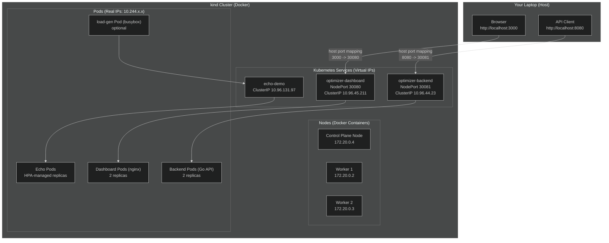
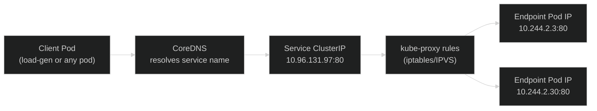
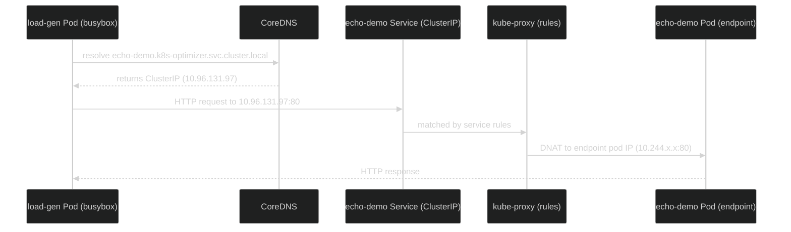
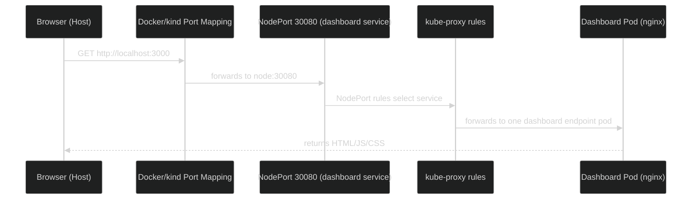
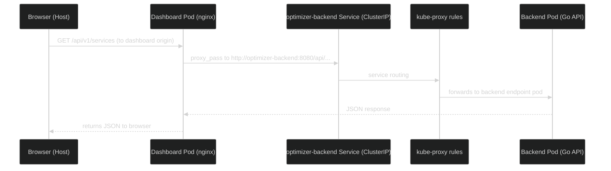
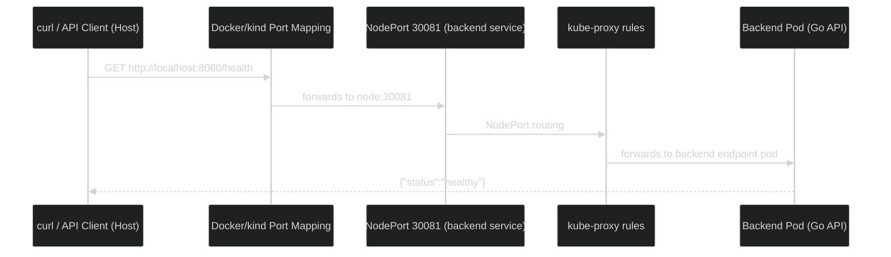
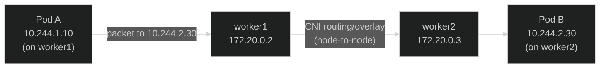

# Kubernetes Networking Learnings (k8s-service-optimizer)

> Repo: **[[Repository Link]](https://github.com/pradeep512/k8s-service-optimizer.git)**

This document summarizes the Kubernetes networking concepts learned using the **k8s-service-optimizer** project on a **3-node kind cluster**.

---

## 1) Cluster Topology and Network Planes

### Nodes (kind = Kubernetes-in-Docker)
- **Control plane node**: `k8s-optimizer-control-plane` (node IP: `172.20.0.4`)
- **Worker nodes**:  
  - `k8s-optimizer-worker` (node IP: `172.20.0.2`)  
  - `k8s-optimizer-worker2` (node IP: `172.20.0.3`)

These node IPs are on a Docker network (node-to-node connectivity).

### Three key “network planes”
1. **Node network** (Docker network): `172.20.0.0/16` (example)  
   Used for node-to-node traffic.
2. **Pod network** (CNI-managed): pod IPs like `10.244.x.x`  
   Used for pod-to-pod traffic across nodes.
3. **Service network** (virtual): Service ClusterIPs like `10.96.x.x`  
   Used as stable virtual front doors to pods.

---

## 2) Pod Networking (Pod IPs are Real)

Each pod receives a **real IP** from the pod CIDR (e.g., `10.244.x.x`).  
Pods are treated as if they share one flat network, even when placed on different nodes.

**Why cross-node pod traffic works**
- The CNI installs routing/overlay rules so a packet to `10.244.*.*` reaches the correct node that hosts that pod.
- Result: **pod-to-pod communication works cluster-wide** without NAT at the app layer.

---

## 3) Service Networking (ClusterIP is Virtual)

A Kubernetes **Service** provides:
- A stable DNS name (e.g., `echo-demo.k8s-optimizer.svc.cluster.local`)
- A stable **ClusterIP** (e.g., `10.96.131.97`)

This ClusterIP is *virtual*. Traffic is forwarded to real pod backends via **kube-proxy** rules.

### Endpoints are the truth
A Service routes to the pod IPs listed as Endpoints:

```bash
kubectl -n k8s-optimizer get endpoints echo-demo -o wide
```

Example output showed:
- `10.244.2.3:80,10.244.2.30:80`

Those pod IPs are where traffic actually lands.

---

## 4) kube-proxy (Why Services “Just Work”)

**kube-proxy** installs rules (iptables or IPVS) so that traffic to:
- `Service ClusterIP:port` or `NodePort`
gets forwarded to one of the Service endpoints (pod IPs).

This behaves **NAT-like (DNAT)** at the network layer:
- Destination is rewritten from Service IP → Pod IP.

Key idea:
- **Service selection / load balancing** is done by kube-proxy rules.
- **Packet delivery across nodes** is handled by the CNI.

---

## 5) DNS Inside the Cluster (CoreDNS)

When a pod requests:
- `echo-demo.k8s-optimizer.svc.cluster.local`

**CoreDNS** resolves the name to the Service ClusterIP (e.g., `10.96.131.97`).  
Then kube-proxy forwards to endpoints.

---

## 6) External Access: NodePort + kind Port Mapping

In this project:
- Dashboard Service: NodePort **30080** → mapped by kind to host **localhost:3000**
- Backend Service: NodePort **30081** → mapped by kind to host **localhost:8080**

So your laptop can access cluster services without a cloud LoadBalancer.

This outer layer is **NAT/port-forwarding** done by Docker/kind.

---

## 7) Application Reverse Proxy: Nginx in the Dashboard

The dashboard container uses **Nginx as a reverse proxy**:
- Browser hits dashboard origin (e.g., `http://localhost:3000`)
- Requests to `/api/*` are proxied to the backend Service (e.g., `http://optimizer-backend:8080`)
- WebSockets (`/ws`) are proxied similarly (Upgrade/Connection headers)

Why it exists:
- Avoid CORS complexity (single origin from the browser’s perspective)
- Keep backend reachable internally via service discovery
- Centralize routing logic for frontend ↔ backend communication

This is **application-layer proxying** (not NAT).

---

## 8) NAT vs Proxy (Quick Distinction)

- **NAT / DNAT**: network-layer rewrite of IP/port (iptables, Docker port mapping, kube-proxy rules)
- **Reverse proxy**: application-layer forwarding (Nginx receives HTTP and makes a new HTTP request)

In this project:
- Docker/kind port mapping: **NAT-like**
- kube-proxy Service forwarding: **DNAT-like**
- Nginx in dashboard: **reverse proxy (L7)**

---

# Network Diagrams (Mermaid)

## Diagram 1: Overall View (Host → Cluster → Workloads)



---

## Diagram 2: Internal Service Routing (ClusterIP → Endpoints)



---

## Diagram 3: Scenario A — Load Generator → echo-demo (In-Cluster)



---

## Diagram 4: Scenario B — Browser → Dashboard via localhost (Host → NodePort)



---

## Diagram 5: Scenario C — Browser → Dashboard → Backend (Nginx reverse proxy)



---

## Diagram 6: Scenario D — Host → Backend directly (localhost:8080)



---

## Diagram 7: Scenario E — Cross-Node Pod-to-Pod Delivery



---

# Verification Commands (Hands-On Checklist)

## A) See nodes and their IPs
```bash
kubectl get nodes -o wide
```

## B) See which pods are on which nodes (and pod IPs)
```bash
kubectl -n k8s-optimizer get pods -o wide
```

## C) See Service IPs and types (ClusterIP vs NodePort)
```bash
kubectl -n k8s-optimizer get svc -o wide
```

## D) See Service endpoints (real backends)
```bash
kubectl -n k8s-optimizer get endpoints echo-demo -o wide
```

## E) Observe HPA and scaling
```bash
kubectl -n k8s-optimizer get hpa -w
kubectl -n k8s-optimizer get deploy echo-demo -w
```

## F) Observe resource usage (metrics-server required)
```bash
kubectl -n k8s-optimizer top pods
kubectl top nodes
```

---

# Practical Troubleshooting Patterns

## “Is traffic still running?”
1. Check if load generator exists and is Running:
   ```bash
   kubectl -n k8s-optimizer get pod load-gen
   ```
2. Check echo-demo CPU usage:
   ```bash
   kubectl -n k8s-optimizer top pods -l app=echo-demo
   ```
3. Check endpoints exist:
   ```bash
   kubectl -n k8s-optimizer get endpoints echo-demo -o wide
   ```

## Why “Connection refused” can happen
- Service name resolves (DNS ok), but:
  - endpoints temporarily empty, or
  - pods not Ready yet, or
  - target container not listening

Validate with:
```bash
kubectl -n k8s-optimizer get endpoints echo-demo -o wide
kubectl -n k8s-optimizer get pods -l app=echo-demo -o wide
```

---

# Optional Deep Dive: Inspect NAT/DNAT Rules (kind)

These commands show how kube-proxy programs NAT rules inside a node container.

1. Enter a node container:
```bash
docker exec -it k8s-optimizer-worker bash
```

2. Find Service ClusterIP rule:
```bash
iptables -t nat -L KUBE-SERVICES -n --line-numbers | grep 10.96.131.97
```

3. Follow the referenced `KUBE-SVC-...` chain and then `KUBE-SEP-...` chains to see DNAT to pod IPs.

For NodePorts:
```bash
iptables -t nat -L KUBE-NODEPORTS -n --line-numbers | egrep '30080|30081'
```

---

## Key Takeaways

- **Pod IPs are real** and reachable cluster-wide via the CNI.
- **Service IPs are virtual** and implemented by kube-proxy rules.
- **Endpoints reveal the true backends** a Service forwards traffic to.
- **NodePort + kind port mapping** is what makes `localhost` access possible in local clusters.
- **Nginx reverse proxy** in the dashboard simplifies browser-to-backend calls and avoids CORS issues.

