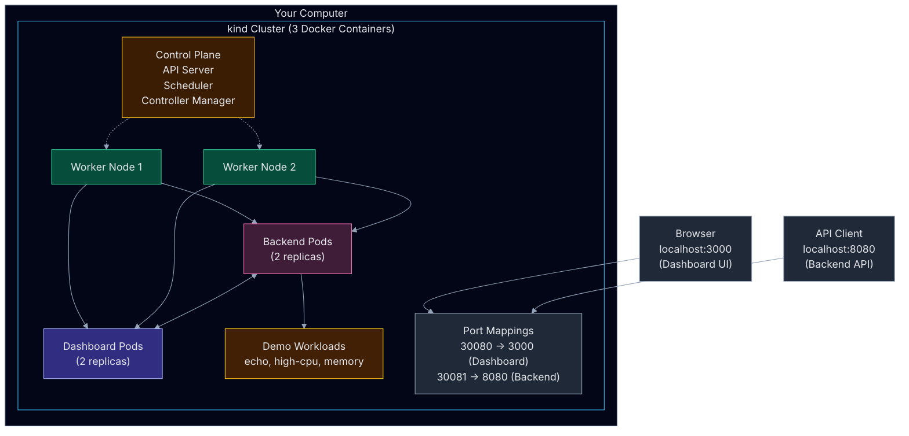
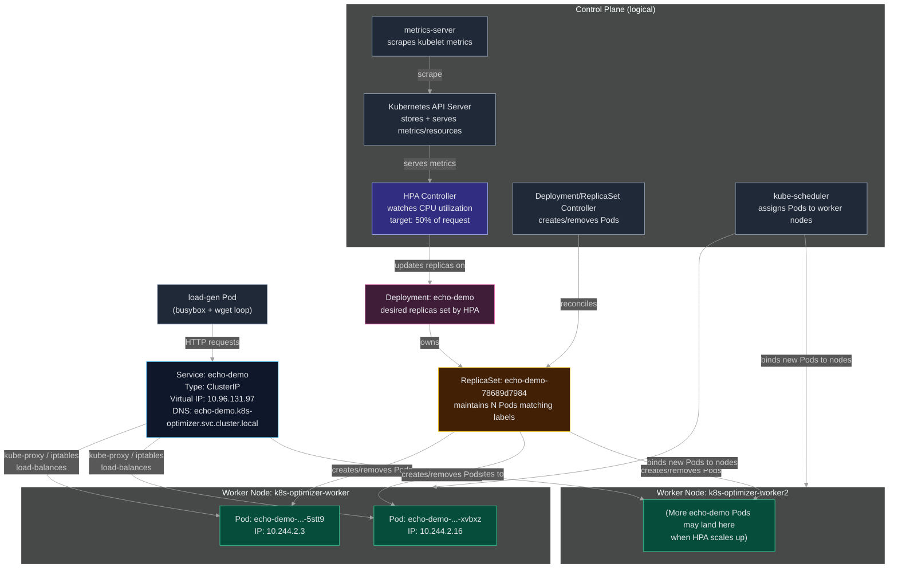
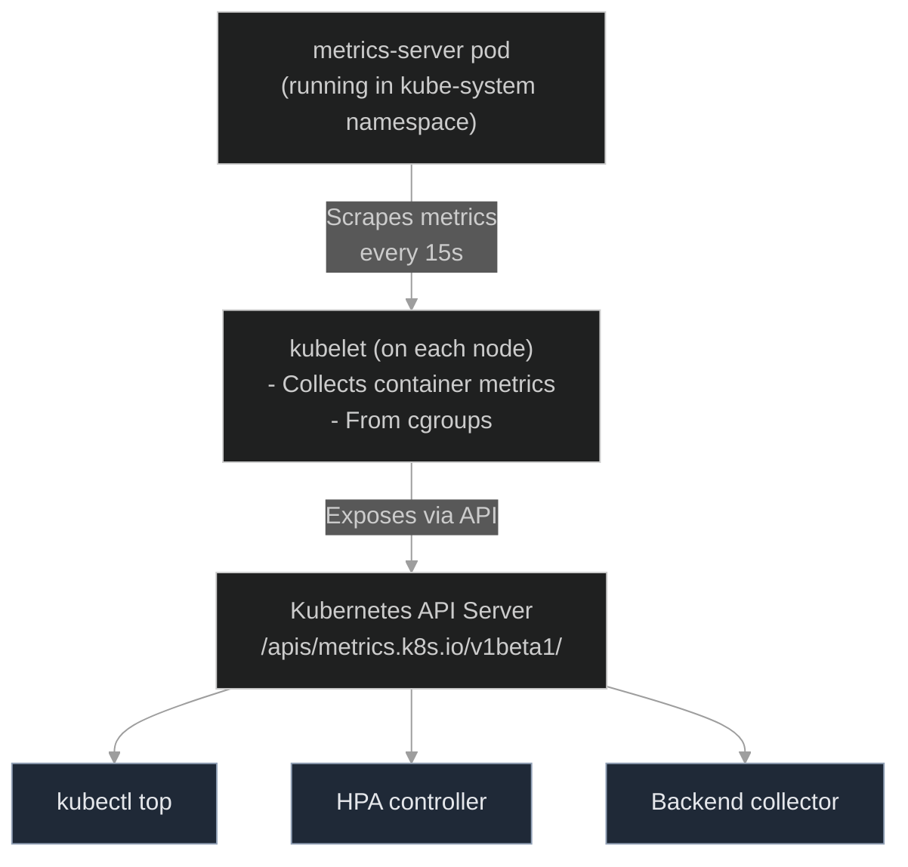
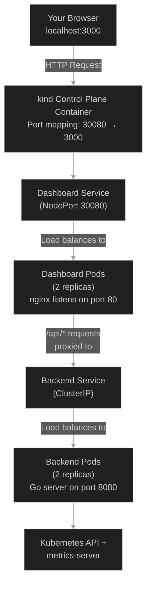

# Learning Kubernetes Through k8s-service-optimizer

## A Hands-On Kubernetes Tutorial Using Real-World Project Files

This guide teaches Kubernetes concepts by walking through the complete setup and deployment of the k8s-service-optimizer project. You'll learn by doing, using actual configuration files and scripts from this repository.

---

## Table of Contents

1. [Project Overview](#1-project-overview)
2. [Repository Map](#2-repository-map)
3. [Prerequisites](#3-prerequisites)
4. [Understanding the Architecture](#4-understanding-the-architecture)
5. [One-Command Deploy: Deep Dive](#5-one-command-deploy-deep-dive)
6. [Kubernetes Primitives Explained](#6-kubernetes-primitives-explained)
7. [Observability and Metrics](#7-observability-and-metrics)
8. [Accessing the UI and API](#8-accessing-the-ui-and-api)
9. [Demo Workload Walkthroughs](#9-demo-workload-walkthroughs)
10. [Troubleshooting Guide](#10-troubleshooting-guide)
11. [QuickLoadTest](#101-quick-load-test-commands)
12. [Learning Exercises](#11-learning-exercises)

---

## 1. Project Overview

### What is k8s-service-optimizer?

The k8s-service-optimizer is a platform that monitors Kubernetes services and provides optimization recommendations. It collects metrics, analyzes resource usage, and helps you understand how your applications are performing.

**Three Main Components:**

1. **Backend API Server** (Go) - Collects metrics from Kubernetes and exposes REST/WebSocket APIs
2. **Web Dashboard** (React) - Visual interface for viewing cluster health and recommendations
3. **Demo Workloads** - Sample applications that demonstrate different resource usage patterns

**What You'll Learn:**

- How to create a multi-node Kubernetes cluster locally
- How pods, services, and deployments work together
- How to monitor resource usage with metrics-server
- How Horizontal Pod Autoscalers (HPA) automatically scale applications
- How Kubernetes RBAC controls access to resources
- How networking and port-forwarding work in Kubernetes
- How to troubleshoot common issues

---

## 2. Repository Map

Understanding the file structure helps you navigate the codebase:

```
k8s-service-optimizer/
├── backend/                          # Go backend application
│   ├── cmd/server/                   # Main application entry point
│   ├── pkg/                          # Core packages (collector, analyzer)
│   ├── Dockerfile                    # Container image definition
│   └── go.mod                        # Go dependencies
│
├── dashboard/                        # React frontend application
│   ├── src/                          # React components and services
│   ├── nginx.conf                    # Nginx proxy configuration
│   ├── Dockerfile                    # Container image definition
│   └── package.json                  # Node dependencies
│
├── infrastructure/                   # Kubernetes cluster setup
│   ├── kind/
│   │   ├── cluster-config.yaml       # Kind cluster definition (3 nodes)
│   │   └── setup.sh                  # Creates the kind cluster
│   └── k8s/
│       ├── namespace.yaml            # k8s-optimizer namespace
│       ├── rbac/
│       │   └── service-account.yaml  # ServiceAccount + ClusterRole + Binding
│       └── metrics-server/
│           └── deploy.sh             # Installs metrics-server
│
├── deployments/                      # Application manifests
│   ├── demo-workloads/
│   │   ├── echo-service.yaml         # Echo app + Service + HPA
│   │   ├── high-cpu-app.yaml        # CPU-intensive stress app
│   │   └── memory-intensive-app.yaml # Memory-intensive app
│   └── optimizer/
│       ├── backend-deployment.yaml   # Backend Deployment + Service
│       └── dashboard-deployment.yaml # Dashboard Deployment + Service
│
└── scripts/                          # Automation scripts
    ├── deploy-all.sh                 # Complete deployment (one command)
    ├── setup.sh                      # Cluster setup only
    ├── build-images.sh               # Build Docker images
    ├── deploy.sh                     # Deploy backend/dashboard
    ├── load-generator.sh             # Generate traffic to test HPA
    └── cleanup.sh                    # Delete everything
```

**Key Files to Study:**

- `infrastructure/kind/cluster-config.yaml` - Defines the cluster topology
- `deployments/demo-workloads/echo-service.yaml` - Complete example with HPA
- `infrastructure/k8s/rbac/service-account.yaml` - RBAC configuration
- `scripts/deploy-all.sh` - Orchestrates the entire deployment

---

## 3. Prerequisites

Before starting, ensure you have these tools installed:

### Required Tools

1. **Docker** (20.10+)
   - Used to build container images and run kind
   - Verify: `docker --version`

2. **kubectl** (1.24+)
   - Kubernetes command-line tool
   - Verify: `kubectl version --client`

3. **kind** (0.20+)
   - Kubernetes IN Docker - runs a cluster in containers
   - Install: https://kind.sigs.k8s.io/docs/user/quick-start/#installation
   - Verify: `kind --version`

4. **Go** (1.21+) - Optional, only if building backend from source
   - Verify: `go version`

5. **Node.js** (18+) - Optional, only if building dashboard from source
   - Verify: `node --version`

### System Requirements

- **RAM**: At least 4GB available (8GB recommended)
- **Disk**: 10GB free space
- **OS**: Linux, macOS, or Windows with WSL2

### Basic Kubernetes Knowledge

You should be comfortable with:
- Using a terminal/command line
- Basic Docker concepts (images, containers)
- Reading YAML files

Don't worry if you're new to Kubernetes - this guide will explain everything!

---

## 4. Understanding the Architecture

### High-Level View



### How Kubernets Control Plane works




### Component Interactions

1. **Metrics Collection**: Backend pods query the Kubernetes API and metrics-server every 15 seconds
2. **Data Processing**: Backend analyzes metrics and generates recommendations
3. **API Exposure**: Backend exposes REST and WebSocket endpoints
4. **Proxy Layer**: Dashboard's nginx proxies API calls to backend
5. **User Interface**: Dashboard fetches data and displays visualizations
6. **Demo Workloads**: Provide realistic data for the optimizer to analyze

---

## 5. One-Command Deploy: Deep Dive

### The Master Script

The file `scripts/deploy-all.sh` orchestrates the entire deployment. Let's walk through each step.

### Running the Deployment

```bash
./scripts/deploy-all.sh
```

When you run this, you'll be prompted to continue. Type `y` and press Enter.

### Step-by-Step Breakdown

#### Step 1: Setup kind Cluster

**What Happens:**
```bash
bash infrastructure/kind/setup.sh
```

This script:
1. Checks if a cluster named "k8s-optimizer" already exists
2. If not, creates a new cluster using `infrastructure/kind/cluster-config.yaml`

**The Cluster Configuration** (`infrastructure/kind/cluster-config.yaml`):

```yaml
kind: Cluster
apiVersion: kind.x-k8s.io/v1alpha4
name: k8s-optimizer
nodes:
  - role: control-plane
    extraPortMappings:
    - containerPort: 30080   # Dashboard NodePort
      hostPort: 3000         # Maps to localhost:3000
      protocol: TCP
    - containerPort: 30081   # Backend NodePort
      hostPort: 8080         # Maps to localhost:8080
      protocol: TCP

  - role: worker
  - role: worker
```

**Key Concepts:**

- **Control Plane**: Manages the cluster (API server, scheduler, controller manager)
- **Worker Nodes**: Run your application pods
- **Port Mappings**: Allow you to access services from your laptop using localhost

**Why 3 Nodes?**
- 1 control plane + 2 workers simulates a real production environment
- Pods can be distributed across workers for high availability
- You can see how Kubernetes schedules workloads

**Verification:**
```bash
# List clusters
kind get clusters

# View nodes
kubectl get nodes

# Expected output:
# NAME                          STATUS   ROLES           AGE   VERSION
# k8s-optimizer-control-plane   Ready    control-plane   1m    v1.30.0
# k8s-optimizer-worker          Ready    <none>          1m    v1.30.0
# k8s-optimizer-worker2         Ready    <none>          1m    v1.30.0
```

---

#### Step 2: Install metrics-server

**What Happens:**
```bash
bash infrastructure/k8s/metrics-server/deploy.sh
```

**The Script** (`infrastructure/k8s/metrics-server/deploy.sh`):

1. Downloads the latest metrics-server from GitHub
2. Patches it for kind (adds `--kubelet-insecure-tls` flag)
3. Waits for it to be ready
4. Tests that metrics collection works

**What is metrics-server?**

Metrics-server is a cluster-wide aggregator of resource usage data. It collects CPU and memory metrics from each node's kubelet (the node agent) and makes them available through the Kubernetes API.

**Why Do We Need It?**

- The Horizontal Pod Autoscaler (HPA) requires metrics to make scaling decisions
- `kubectl top` commands need metrics-server to display resource usage
- Our backend uses these metrics to analyze service health

**Verification:**
```bash
# Check metrics-server pod
kubectl -n kube-system get pods | grep metrics-server

# Test metrics collection (may take 30s to start working)
kubectl top nodes

# Expected output:
# NAME                          CPU(cores)   CPU%   MEMORY(bytes)   MEMORY%
# k8s-optimizer-control-plane   89m          0%     621Mi           1%
# k8s-optimizer-worker          18m          0%     196Mi           0%
# k8s-optimizer-worker2         22m          0%     164Mi           0%
```

---

#### Step 3: Create Namespace and RBAC

**What Happens:**
```bash
kubectl apply -f infrastructure/k8s/namespace.yaml
kubectl apply -f infrastructure/k8s/rbac/
```

**Namespace** (`infrastructure/k8s/namespace.yaml`):

```yaml
apiVersion: v1
kind: Namespace
metadata:
  name: k8s-optimizer
  labels:
    name: k8s-optimizer
```

**What is a Namespace?**

A namespace is like a virtual cluster inside your cluster. It provides:
- **Isolation**: Resources in different namespaces don't conflict
- **Organization**: Logical grouping of related resources
- **Access Control**: RBAC policies can be applied per-namespace

**Our Namespace Strategy:**
- `k8s-optimizer`: Contains all our application components
- `kube-system`: Kubernetes system components (metrics-server)
- `default`: Not used in this project

**RBAC Configuration** (`infrastructure/k8s/rbac/service-account.yaml`):

This file creates three resources:

1. **ServiceAccount** - Identity for the backend pods
2. **ClusterRole** - Permissions needed
3. **ClusterRoleBinding** - Grants permissions to the ServiceAccount

**Why Does the Backend Need RBAC?**

The backend needs to:
- Read pod metrics (`kubectl top pods` equivalent)
- List deployments, services, nodes
- Get HPA status
- Update HPAs (for optimization recommendations)
- Watch for resource changes

**The Permissions:**

```yaml
rules:
  # Read all resources for analysis
  - apiGroups: [""]
    resources: ["pods", "services", "nodes", "namespaces"]
    verbs: ["get", "list", "watch"]

  # Manage deployments for optimization
  - apiGroups: ["apps"]
    resources: ["deployments"]
    verbs: ["get", "list", "watch", "update", "patch"]

  # Manage HPAs
  - apiGroups: ["autoscaling"]
    resources: ["horizontalpodautoscalers"]
    verbs: ["get", "list", "watch", "create", "update", "patch"]

  # Access metrics
  - apiGroups: ["metrics.k8s.io"]
    resources: ["pods", "nodes"]
    verbs: ["get", "list"]
```

**Security Note:** The ClusterRole is cluster-wide, not namespace-scoped, because the backend monitors multiple namespaces.

**Verification:**
```bash
# Check namespace
kubectl get namespace k8s-optimizer

# Check ServiceAccount
kubectl -n k8s-optimizer get serviceaccount optimizer-sa

# Check ClusterRole
kubectl get clusterrole optimizer-role

# Check Binding
kubectl get clusterrolebinding optimizer-binding
```

---

#### Step 4: Deploy Demo Workloads

**What Happens:**
```bash
kubectl apply -f deployments/demo-workloads/
```

This deploys three applications that showcase different resource patterns:

1. **echo-demo** - HTTP echo service with HPA
2. **high-cpu-app** - CPU-intensive stress test
3. **memory-intensive-app** - Memory-intensive workload

**Echo Service Deep Dive** (`deployments/demo-workloads/echo-service.yaml`):

This file contains three Kubernetes resources:

**1. Deployment:**
```yaml
apiVersion: apps/v1
kind: Deployment
metadata:
  name: echo-demo
  namespace: k8s-optimizer
spec:
  replicas: 3
  selector:
    matchLabels:
      app: echo-demo
  template:
    metadata:
      labels:
        app: echo-demo
    spec:
      containers:
        - name: echo
          image: ealen/echo-server:0.9.2
          ports:
            - containerPort: 80
          resources:
            requests:
              cpu: 50m
              memory: 64Mi
            limits:
              cpu: 200m
              memory: 128Mi
```

**Key Concepts:**

- **replicas: 3** - Kubernetes keeps 3 copies of this pod running
- **selector.matchLabels** - How the Deployment finds its pods
- **template** - Blueprint for creating pods
- **resources.requests** - Minimum resources guaranteed
- **resources.limits** - Maximum resources allowed

**2. Service:**
```yaml
apiVersion: v1
kind: Service
metadata:
  name: echo-demo
  namespace: k8s-optimizer
spec:
  selector:
    app: echo-demo
  ports:
    - port: 80
      targetPort: 80
  type: ClusterIP
```

**What is a Service?**

A Service provides:
- **Stable DNS name**: `echo-demo.k8s-optimizer.svc.cluster.local`
- **Load balancing**: Distributes traffic across all pods
- **Service discovery**: Other pods can find this service by name

**Service Types:**
- **ClusterIP** (used here): Only accessible within the cluster
- **NodePort** (used for backend/dashboard): Accessible from outside
- **LoadBalancer**: For cloud providers

**3. HorizontalPodAutoscaler (HPA):**
```yaml
apiVersion: autoscaling/v2
kind: HorizontalPodAutoscaler
metadata:
  name: echo-demo-hpa
  namespace: k8s-optimizer
spec:
  scaleTargetRef:
    apiVersion: apps/v1
    kind: Deployment
    name: echo-demo
  minReplicas: 2
  maxReplicas: 10
  metrics:
    - type: Resource
      resource:
        name: cpu
        target:
          type: Utilization
          averageUtilization: 50
```

**What is HPA?**

The HorizontalPodAutoscaler automatically scales the number of pods based on metrics:

- **scaleTargetRef**: Which Deployment to scale
- **minReplicas: 2**: Never go below 2 pods
- **maxReplicas: 10**: Never exceed 10 pods
- **averageUtilization: 50**: Target 50% CPU usage across all pods

**How HPA Works:**

1. HPA queries metrics-server every 15 seconds
2. Calculates: `desiredReplicas = ceil(currentReplicas * (currentMetric / targetMetric))`
3. If current CPU is 100% and target is 50%: `desiredReplicas = ceil(2 * (100 / 50)) = 4`
4. Gradually scales up or down (default: 1 pod per 15s for scale-up, 1 pod per 5 minutes for scale-down)

**High-CPU App** (`deployments/demo-workloads/high-cpu-app.yaml`):

```yaml
containers:
  - name: stress
    image: polinux/stress
    command: ["stress"]
    args:
      - "--cpu"
      - "1"
      - "--timeout"
      - "3600s"
    resources:
      requests:
        cpu: 100m
      limits:
        cpu: 500m
```

This pod runs a CPU stress test that consumes CPU cycles, demonstrating:
- How resource limits work
- How the optimizer detects high CPU usage
- How metrics-server tracks resource consumption

**Verification:**
```bash
# List all resources in namespace
kubectl -n k8s-optimizer get all

# Check HPA status
kubectl -n k8s-optimizer get hpa

# Expected output:
# NAME            REFERENCE              TARGETS       MINPODS   MAXPODS   REPLICAS
# echo-demo-hpa   Deployment/echo-demo   cpu: 2%/50%   2         10        2

# View pod resource usage
kubectl top pods -n k8s-optimizer

# Watch HPA in real-time
kubectl -n k8s-optimizer get hpa -w
```

---

#### Step 5: Build Docker Images

**What Happens:**
```bash
bash scripts/build-images.sh
```

**The Script** (`scripts/build-images.sh`):

1. Builds backend Docker image from `backend/Dockerfile`
2. Builds dashboard Docker image from `dashboard/Dockerfile`
3. Loads both images into the kind cluster using `kind load docker-image`

**Why Load Images into kind?**

Kind runs Kubernetes in Docker containers. By default, those containers can't access images on your local Docker. The `kind load` command copies images into the kind cluster's internal registry.

**Backend Dockerfile** (`backend/Dockerfile`):

Uses multi-stage build:
1. **Stage 1**: Compiles Go code
2. **Stage 2**: Creates minimal runtime image with just the binary

**Dashboard Dockerfile** (`dashboard/Dockerfile`):

Uses multi-stage build:
1. **Stage 1**: Builds React app with npm
2. **Stage 2**: nginx serves the static files

**Dashboard nginx Configuration** (`dashboard/nginx.conf`):

```nginx
location /api/ {
    proxy_pass http://optimizer-backend:8080/api/;
}

location /ws {
    proxy_pass http://optimizer-backend:8080/ws;
    proxy_set_header Upgrade $http_upgrade;
    proxy_set_header Connection "upgrade";
}
```

**Why Proxy?**

The dashboard runs in the browser and needs to call the backend API. The nginx proxy:
- Avoids CORS issues
- Provides a single origin for frontend and backend
- Enables WebSocket connections for real-time updates

**Verification:**
```bash
# List Docker images
docker images | grep k8s-optimizer

# Expected output:
# k8s-optimizer-backend      latest   87371a0a27d9   45.9MB
# k8s-optimizer-dashboard    latest   14d04d6c4207   55.4MB

# Check images loaded in kind
docker exec k8s-optimizer-control-plane crictl images | grep k8s-optimizer
```

---

#### Step 6: Deploy Optimizer

**What Happens:**
```bash
bash scripts/deploy.sh
```

This deploys:
1. Backend (2 replicas)
2. Dashboard (2 replicas)

**Backend Deployment** (`deployments/optimizer/backend-deployment.yaml`):

```yaml
spec:
  replicas: 2
  template:
    spec:
      serviceAccountName: optimizer-sa  # Uses RBAC from Step 3
      containers:
        - name: backend
          image: k8s-optimizer-backend:latest
          imagePullPolicy: Never  # Use local image
          ports:
            - containerPort: 8080
          env:
            - name: PORT
              value: "8080"
            - name: UPDATE_INTERVAL
              value: "5s"
            - name: NAMESPACES
              value: "k8s-optimizer,default"
          livenessProbe:
            httpGet:
              path: /health
              port: 8080
          readinessProbe:
            httpGet:
              path: /ready
              port: 8080
```

**Important Fields:**

- **serviceAccountName**: Links to the RBAC ServiceAccount
- **imagePullPolicy: Never**: Don't try to pull from Docker Hub
- **env.NAMESPACES**: Which namespaces to monitor
- **livenessProbe**: Kubernetes restarts pod if this fails
- **readinessProbe**: Pod receives traffic only if this succeeds

**Backend Service:**

```yaml
apiVersion: v1
kind: Service
metadata:
  name: optimizer-backend
spec:
  type: NodePort
  selector:
    app: optimizer-backend
  ports:
    - port: 8080
      targetPort: 8080
      nodePort: 30081
```

**NodePort: 30081**

The kind cluster maps this to `localhost:8080` via the port mapping in `cluster-config.yaml`:

```yaml
extraPortMappings:
  - containerPort: 30081
    hostPort: 8080
```

**Dashboard Deployment** (`deployments/optimizer/dashboard-deployment.yaml`):

Similar structure, but:
- Uses `k8s-optimizer-dashboard:latest` image
- Exposes port 80 (nginx)
- NodePort: 30080 maps to `localhost:3000`

**Verification:**
```bash
# Check deployments
kubectl -n k8s-optimizer get deployments

# Expected output:
# NAME                  READY   UP-TO-DATE   AVAILABLE   AGE
# optimizer-backend     2/2     2            2           1m
# optimizer-dashboard   2/2     2            2           1m

# Check services
kubectl -n k8s-optimizer get services

# Check pod logs
kubectl -n k8s-optimizer logs -l app=optimizer-backend --tail=20

# Test backend health
curl http://localhost:8080/health

# Expected output:
# {"success":true,"data":{"status":"healthy"}}
```

---

## 6. Kubernetes Primitives Explained

### Pod

**What**: The smallest deployable unit in Kubernetes. A pod runs one or more containers.

**Real Example**: Each echo-demo instance is a pod.

```bash
# List pods
kubectl -n k8s-optimizer get pods

# Describe a pod
kubectl -n k8s-optimizer describe pod <pod-name>

# View pod logs
kubectl -n k8s-optimizer logs <pod-name>

# Execute command in pod
kubectl -n k8s-optimizer exec -it <pod-name> -- sh
```

**Pod Lifecycle:**
1. **Pending**: Waiting to be scheduled
2. **Running**: Container is running
3. **Succeeded**: Container exited with 0
4. **Failed**: Container exited with non-zero
5. **Unknown**: Status cannot be determined

---

### Deployment

**What**: Manages a set of identical pods. Handles rolling updates and rollbacks.

**Real Example**: `echo-demo` Deployment maintains 3 replicas.

```bash
# List deployments
kubectl -n k8s-optimizer get deployments

# Scale deployment
kubectl -n k8s-optimizer scale deployment echo-demo --replicas=5

# View rollout status
kubectl -n k8s-optimizer rollout status deployment echo-demo

# View rollout history
kubectl -n k8s-optimizer rollout history deployment echo-demo
```

**Deployment Features:**
- **Self-healing**: Recreates pods if they crash
- **Rolling updates**: Updates pods gradually
- **Rollback**: Can undo bad deployments
- **Declarative**: You specify desired state, Kubernetes makes it happen

---

### Service

**What**: Provides network access to a set of pods. Acts as a load balancer.

**Real Example**: `echo-demo` Service load-balances across echo pods.

```bash
# List services
kubectl -n k8s-optimizer get services

# Describe service
kubectl -n k8s-optimizer describe service echo-demo

# Access service from within cluster
kubectl -n k8s-optimizer run test-pod --rm -it --image=busybox -- \
  wget -qO- http://echo-demo
```

**Service Types:**
- **ClusterIP**: Internal only (echo-demo)
- **NodePort**: Accessible from host (backend, dashboard)
- **LoadBalancer**: Cloud load balancer (not used in kind)

---

### HorizontalPodAutoscaler (HPA)

**What**: Automatically scales pods based on metrics.

**Real Example**: `echo-demo-hpa` scales between 2-10 pods based on CPU.

```bash
# View HPA
kubectl -n k8s-optimizer get hpa

# Describe HPA
kubectl -n k8s-optimizer describe hpa echo-demo-hpa

# Watch scaling events
kubectl -n k8s-optimizer get hpa -w
```

**HPA Algorithm:**

```
desiredReplicas = ceil[currentReplicas * (currentMetricValue / targetMetricValue)]
```

Example:
- Current: 2 replicas, 100% CPU
- Target: 50% CPU
- Desired: ceil(2 * (100 / 50)) = 4 replicas

---

### Namespace

**What**: Virtual cluster for organizing resources.

```bash
# List namespaces
kubectl get namespaces

# View resources in namespace
kubectl -n k8s-optimizer get all

# Create namespace
kubectl create namespace my-namespace

# Delete namespace (deletes all resources inside)
kubectl delete namespace my-namespace
```

**Why Use Namespaces?**
- **Multi-tenancy**: Separate dev/staging/prod
- **Resource quotas**: Limit namespace resource usage
- **Access control**: Different teams, different permissions

---

### ServiceAccount, ClusterRole, ClusterRoleBinding (RBAC)

**What**: Controls who can do what in the cluster.

**Real Example**: Backend uses `optimizer-sa` to access Kubernetes API.

```bash
# View ServiceAccount
kubectl -n k8s-optimizer get serviceaccount optimizer-sa

# View ClusterRole
kubectl get clusterrole optimizer-role -o yaml

# View binding
kubectl get clusterrolebinding optimizer-binding -o yaml

# Test permissions
kubectl auth can-i list pods --as=system:serviceaccount:k8s-optimizer:optimizer-sa
```

**RBAC Components:**
- **ServiceAccount**: Identity for pods
- **Role/ClusterRole**: Set of permissions
- **RoleBinding/ClusterRoleBinding**: Grants permissions to identity

**Role vs ClusterRole:**
- **Role**: Namespace-scoped
- **ClusterRole**: Cluster-wide (used for our backend)

---

## 7. Observability and Metrics

### metrics-server Architecture



### Using metrics-server

```bash
# View node metrics
kubectl top nodes

# View pod metrics (all namespaces)
kubectl top pods -A

# View pod metrics (specific namespace)
kubectl top pods -n k8s-optimizer

# Sort by CPU
kubectl top pods -n k8s-optimizer --sort-by=cpu

# Sort by memory
kubectl top pods -n k8s-optimizer --sort-by=memory
```

### Backend Metrics Collection

The backend (`backend/pkg/collector/`) collects:

1. **Pod Metrics**
   - CPU usage (millicores)
   - Memory usage (bytes)
   - Per-container breakdown

2. **Node Metrics**
   - Total CPU capacity and usage
   - Total memory capacity and usage

3. **HPA Metrics**
   - Current vs desired replicas
   - CPU utilization vs target
   - Scaling events

4. **Deployment Info**
   - Replica count
   - Resource requests/limits
   - Health status

**Collection Interval**: Every 15 seconds (configurable via `UPDATE_INTERVAL` env var)

**Data Retention**: 24 hours of historical data (in-memory)

### Viewing Backend Metrics

```bash
# Cluster overview
curl http://localhost:8080/api/v1/cluster/overview

# Service list
curl http://localhost:8080/api/v1/services

# Recommendations
curl http://localhost:8080/api/v1/recommendations
```

---

## 8. Accessing the UI and API

### Network Flow



### Accessing the Dashboard

**Option 1: Direct Access (Recommended)**

```bash
# Dashboard is automatically available at:
open http://localhost:3000
```

This works because of the port mapping in `infrastructure/kind/cluster-config.yaml`:
```yaml
extraPortMappings:
  - containerPort: 30080  # Dashboard NodePort
    hostPort: 3000        # Maps to localhost:3000
```

**Option 2: Port Forward**

```bash
# Forward dashboard service
kubectl -n k8s-optimizer port-forward svc/optimizer-dashboard 3000:80
```

### Accessing the Backend API

**Direct Access:**

```bash
# Health check
curl http://localhost:8080/health

# Cluster overview
curl http://localhost:8080/api/v1/cluster/overview | jq .

# Services list
curl http://localhost:8080/api/v1/services | jq .

# Recommendations
curl http://localhost:8080/api/v1/recommendations | jq .
```

**WebSocket (Real-time Updates):**

```bash
# Using wscat (install: npm install -g wscat)
wscat -c ws://localhost:8080/ws
```

### NodePort vs ClusterIP

**NodePort Services:**
- `optimizer-dashboard`: NodePort 30080 → localhost:3000
- `optimizer-backend`: NodePort 30081 → localhost:8080

**ClusterIP Services (internal only):**
- `echo-demo`
- `high-cpu-app`
- `memory-intensive-app`

### Testing Internal Services

To test ClusterIP services, you need to be inside the cluster:

```bash
# Create a test pod
kubectl -n k8s-optimizer run test-pod --rm -it --image=busybox -- sh

# Inside the pod, test services:
wget -qO- http://echo-demo
wget -qO- http://high-cpu-app:8080
```

---

## 9. Demo Workload Walkthroughs

### Demo 1: Echo Service with HPA Scaling

This demo shows how HPA automatically scales pods based on CPU usage.

**Initial State:**

```bash
# Check HPA
kubectl -n k8s-optimizer get hpa echo-demo-hpa

# Output:
# NAME            REFERENCE              TARGETS      MINPODS   MAXPODS   REPLICAS
# echo-demo-hpa   Deployment/echo-demo   cpu: 2%/50%  2         10        2

# 2% CPU usage, target is 50%, so we're at minimum replicas
```

**Generate Load:**

```bash
# In one terminal, run the load generator
./scripts/load-generator.sh
```

This script (`scripts/load-generator.sh`) creates a pod that sends requests in a loop:

```bash
kubectl run -it --rm load-gen --image=busybox -n k8s-optimizer -- sh -c "
  while true; do
    wget -q -O- http://echo-demo.k8s-optimizer.svc.cluster.local
    sleep 0.1
  done
"
```

**Watch Scaling:**

```bash
# In another terminal, watch HPA
watch kubectl -n k8s-optimizer get hpa

# You'll see CPU% increase, then replicas increase:
# NAME            REFERENCE              TARGETS       MINPODS   MAXPODS   REPLICAS
# echo-demo-hpa   Deployment/echo-demo   cpu: 85%/50%  2         10        2
# (wait 15s)
# echo-demo-hpa   Deployment/echo-demo   cpu: 60%/50%  2         10        3
# (wait 15s)
# echo-demo-hpa   Deployment/echo-demo   cpu: 45%/50%  2         10        4
```

**Stop Load:**

Press Ctrl+C in the load generator terminal.

**Watch Scale Down:**

```bash
# Scale-down is slower (5 minute wait by default)
watch kubectl -n k8s-optimizer get hpa

# After 5 minutes:
# echo-demo-hpa   Deployment/echo-demo   cpu: 2%/50%   2         10        3
# (wait 5 more minutes)
# echo-demo-hpa   Deployment/echo-demo   cpu: 2%/50%   2         10        2
```

**Why Scale Down is Slower:**

Kubernetes avoids "flapping" (rapid scale up/down). The default scale-down stabilization is 5 minutes.

**View Scaling Events:**

```bash
kubectl -n k8s-optimizer describe hpa echo-demo-hpa

# Look for events like:
# Normal  SuccessfulRescale  2m  HPA  New size: 4; reason: cpu resource utilization (percentage of request) above target
```

---

### Demo 2: High-CPU Application Analysis

This demo shows how the optimizer detects inefficient resource usage.

**Check High-CPU App Status:**

```bash
# View pods
kubectl -n k8s-optimizer get pods -l app=high-cpu-app

# Check CPU usage
kubectl top pods -n k8s-optimizer -l app=high-cpu-app

# Output:
# NAME                            CPU(cores)   MEMORY(bytes)
# high-cpu-app-5ddc786c6b-j9nxm   500m         1Mi
# high-cpu-app-5ddc786c6b-xw8h4   501m         16Mi
```

**Understand the Configuration:**

From `deployments/demo-workloads/high-cpu-app.yaml`:

```yaml
resources:
  requests:
    cpu: 100m
  limits:
    cpu: 500m
```

**Analysis:**

- **Requested**: 100m (0.1 cores)
- **Using**: 500m (0.5 cores)
- **Utilization**: 500% over request

**What the Optimizer Detects:**

```bash
# Check recommendations
curl http://localhost:8080/api/v1/recommendations | jq .
```

The backend would generate a recommendation like:
- "Increase CPU request from 100m to 500m"
- "This pod is CPU throttled"

**View Detailed Metrics:**

```bash
# Backend exposes detailed pod metrics
curl http://localhost:8080/api/v1/metrics/pods/k8s-optimizer | jq .
```

---

### Demo 3: Memory-Intensive Application

**Check Memory App:**

```bash
# View memory usage
kubectl top pods -n k8s-optimizer -l app=memory-intensive-app

# Output:
# NAME                                    CPU(cores)   MEMORY(bytes)
# memory-intensive-app-5855775586-q5fcq   23m          257Mi
```

**Understand the Workload:**

The memory-intensive app allocates and holds memory, simulating a cache or data processing application.

**Resource Configuration:**

```yaml
resources:
  requests:
    memory: 128Mi
  limits:
    memory: 512Mi
```

**Analysis:**

- **Requested**: 128Mi
- **Using**: 257Mi
- **Utilization**: 200% of request (within limit)

**Scheduling Implications:**

When Kubernetes schedules this pod:
1. Checks if node has 128Mi available (request)
2. Pod is placed on that node
3. Pod can use up to 512Mi (limit)
4. If pod exceeds 512Mi, it gets OOMKilled (Out Of Memory)

---

## 10. Troubleshooting Guide

### Common Issues and Solutions

#### Issue 1: Pods Not Starting

**Symptoms:**
```bash
kubectl -n k8s-optimizer get pods

# NAME                                 READY   STATUS             RESTARTS
# optimizer-backend-69fdccfcd6-b6wlq   0/1     CrashLoopBackOff   5
```

**Diagnosis:**

```bash
# Check pod events
kubectl -n k8s-optimizer describe pod <pod-name>

# Check logs
kubectl -n k8s-optimizer logs <pod-name>

# Check previous logs (if restarting)
kubectl -n k8s-optimizer logs <pod-name> --previous
```

**Common Causes:**

1. **Image not found**: Check `imagePullPolicy: Never` is set for local images
2. **Insufficient resources**: Node doesn't have enough CPU/memory
3. **Application error**: Check logs for panic or errors
4. **Missing config**: Environment variables or secrets not set

**Solution:**

```bash
# Check node resources
kubectl top nodes

# Check if image is loaded
docker exec k8s-optimizer-control-plane crictl images | grep k8s-optimizer

# Rebuild and reload image
./scripts/build-images.sh
kubectl -n k8s-optimizer delete pods -l app=optimizer-backend
```

---

#### Issue 2: HPA Not Scaling

**Symptoms:**

```bash
kubectl -n k8s-optimizer get hpa

# NAME            REFERENCE              TARGETS         MINPODS   MAXPODS   REPLICAS
# echo-demo-hpa   Deployment/echo-demo   <unknown>/50%   2         10        0
```

**Diagnosis:**

```bash
# Check metrics-server
kubectl -n kube-system get pods -l k8s-app=metrics-server

# Test metrics collection
kubectl top nodes
kubectl top pods -n k8s-optimizer

# Check HPA events
kubectl -n k8s-optimizer describe hpa echo-demo-hpa
```

**Common Causes:**

1. **metrics-server not ready**: Takes ~30s after install
2. **No resource requests**: HPA requires pods to have CPU requests
3. **metrics-server crashed**: Check logs

**Solution:**

```bash
# Wait for metrics-server
kubectl -n kube-system rollout status deployment metrics-server

# Restart metrics-server if needed
kubectl -n kube-system rollout restart deployment metrics-server

# Check pod has resource requests
kubectl -n k8s-optimizer get deployment echo-demo -o yaml | grep -A 5 resources
```

---

#### Issue 3: Cannot Access Dashboard

**Symptoms:**

```bash
curl http://localhost:3000
# Connection refused
```

**Diagnosis:**

```bash
# Check dashboard pods
kubectl -n k8s-optimizer get pods -l app=optimizer-dashboard

# Check service
kubectl -n k8s-optimizer get svc optimizer-dashboard

# Check NodePort
kubectl -n k8s-optimizer get svc optimizer-dashboard -o yaml | grep nodePort
```

**Common Causes:**

1. **Wrong port mapping**: kind cluster config issue
2. **Pods not ready**: Dashboard still starting
3. **Service misconfigured**: NodePort not set

**Solution:**

```bash
# Check kind port mappings
docker ps | grep k8s-optimizer-control-plane

# Forward port manually
kubectl -n k8s-optimizer port-forward svc/optimizer-dashboard 3000:80

# Check dashboard logs
kubectl -n k8s-optimizer logs -l app=optimizer-dashboard
```

---

#### Issue 4: Backend Cannot Collect Metrics

**Symptoms:**

Backend logs show:
```
Error collecting metrics: pods is forbidden: User "system:serviceaccount:k8s-optimizer:optimizer-sa" cannot list resource "pods"
```

**Diagnosis:**

```bash
# Check ServiceAccount
kubectl -n k8s-optimizer get sa optimizer-sa

# Check ClusterRole
kubectl get clusterrole optimizer-role

# Check binding
kubectl get clusterrolebinding optimizer-binding

# Test permissions
kubectl auth can-i list pods --as=system:serviceaccount:k8s-optimizer:optimizer-sa
```

**Solution:**

```bash
# Reapply RBAC
kubectl apply -f infrastructure/k8s/rbac/

# Restart backend
kubectl -n k8s-optimizer rollout restart deployment optimizer-backend
```

---

#### Issue 5: Kind Cluster Issues

**Symptoms:**

```bash
kind get clusters
# Error: failed to list clusters
```

**Diagnosis:**

```bash
# Check Docker
docker ps

# Check kind binary
which kind
kind --version
```

**Solution:**

```bash
# Delete and recreate cluster
kind delete cluster --name k8s-optimizer
./scripts/deploy-all.sh

# If Docker issues
# Restart Docker daemon
sudo systemctl restart docker  # Linux
# Restart Docker Desktop        # Mac/Windows
```

---

### Useful Troubleshooting Commands

```bash
# View all resources
kubectl -n k8s-optimizer get all

# View events (sorted by time)
kubectl -n k8s-optimizer get events --sort-by=.lastTimestamp

# Describe specific resource
kubectl -n k8s-optimizer describe <resource-type> <name>

# View logs (follow mode)
kubectl -n k8s-optimizer logs -f <pod-name>

# View logs (all containers in deployment)
kubectl -n k8s-optimizer logs -l app=optimizer-backend --all-containers

# Get YAML definition
kubectl -n k8s-optimizer get <resource-type> <name> -o yaml

# Check resource usage
kubectl top nodes
kubectl top pods -A

# Port-forward for debugging
kubectl -n k8s-optimizer port-forward <pod-name> 8080:8080

# Execute command in pod
kubectl -n k8s-optimizer exec -it <pod-name> -- sh

# Copy files from pod
kubectl -n k8s-optimizer cp <pod-name>:/path/to/file ./local-file
```


## 10.1. Quick load test commands 

### Generate Load

``` bash

kubectl -n k8s-optimizer delete pod load-gen 2>/dev/null || true

kubectl -n k8s-optimizer run -it --rm load-gen \
  --image=busybox \
  --restart=Never \
  -- sh -c '
  for i in $(seq 1 5); do
    while true; do
      wget -q -O- http://echo-demo.k8s-optimizer.svc.cluster.local >/dev/null
      sleep 0.02
    done &
  done
  wait'

```

### Observe HPA 

```bash
kubectl -n k8s-optimizer get hpa -w
```

### Observe pods

```bash
kubectl -n k8s-optimizer get all

kubectl -n k8s-optimizer top pods
```

---

## 11. Learning Exercises

### Exercise 1: Modify HPA Target

**Goal**: Understand how changing HPA targets affects scaling behavior.

**Steps:**

1. Edit the HPA:
```bash
kubectl -n k8s-optimizer edit hpa echo-demo-hpa
```

2. Change `averageUtilization` from 50 to 20:
```yaml
target:
  type: Utilization
  averageUtilization: 20  # Changed from 50
```

3. Save and exit

4. Observe:
```bash
watch kubectl -n k8s-optimizer get hpa
```

**Expected Result**: HPA will scale up because current usage (2%) is still below 20% utilization per pod, but once load is applied, it will scale earlier and more aggressively.

**Question**: What happens if you set `averageUtilization` to 5? Why?

---

### Exercise 2: Add Custom Deployment

**Goal**: Practice creating your own Kubernetes resources.

**Steps:**

1. Create a file `my-app.yaml`:
```yaml
apiVersion: apps/v1
kind: Deployment
metadata:
  name: my-nginx
  namespace: k8s-optimizer
spec:
  replicas: 2
  selector:
    matchLabels:
      app: my-nginx
  template:
    metadata:
      labels:
        app: my-nginx
    spec:
      containers:
        - name: nginx
          image: nginx:alpine
          ports:
            - containerPort: 80
          resources:
            requests:
              cpu: 50m
              memory: 64Mi
            limits:
              cpu: 100m
              memory: 128Mi
---
apiVersion: v1
kind: Service
metadata:
  name: my-nginx
  namespace: k8s-optimizer
spec:
  selector:
    app: my-nginx
  ports:
    - port: 80
      targetPort: 80
  type: ClusterIP
```

2. Apply it:
```bash
kubectl apply -f my-app.yaml
```

3. Verify:
```bash
kubectl -n k8s-optimizer get pods -l app=my-nginx
```

4. Test it:
```bash
kubectl -n k8s-optimizer run test --rm -it --image=busybox -- \
  wget -qO- http://my-nginx
```

**Challenge**: Add an HPA to this deployment with custom settings.

---

### Exercise 3: Observe Pod Lifecycle

**Goal**: Understand what happens when pods are created, updated, and deleted.

**Steps:**

1. Watch pods in real-time:
```bash
watch kubectl -n k8s-optimizer get pods -l app=echo-demo
```

2. In another terminal, scale the deployment:
```bash
kubectl -n k8s-optimizer scale deployment echo-demo --replicas=5
```

**Observe**: New pods go through: Pending → ContainerCreating → Running

3. Delete a pod:
```bash
kubectl -n k8s-optimizer delete pod <pod-name>
```

**Observe**: Deployment immediately creates a new pod to maintain desired replica count.

4. Update the deployment:
```bash
kubectl -n k8s-optimizer set image deployment/echo-demo echo=ealen/echo-server:latest
```

**Observe**: Rolling update - new pods created, old pods terminated gradually.

---

### Exercise 4: Resource Request/Limit Experiments

**Goal**: Understand the impact of resource settings on scheduling and performance.

**Steps:**

1. Check current node capacity:
```bash
kubectl describe nodes | grep -A 5 "Allocated resources"
```

2. Try to create a pod with massive requests:
```bash
kubectl -n k8s-optimizer run huge-pod --image=nginx \
  --requests='cpu=10000m,memory=100Gi'
```

**Expected**: Pod stays Pending because no node has enough resources.

3. Check why:
```bash
kubectl -n k8s-optimizer describe pod huge-pod
```

4. Delete it:
```bash
kubectl -n k8s-optimizer delete pod huge-pod
```

**Question**: What's the difference between a pod that's Pending due to resources vs ImagePullBackOff?

---

### Exercise 5: RBAC Experiment

**Goal**: Understand how RBAC restricts access.

**Steps:**

1. Create a restricted ServiceAccount:
```bash
kubectl -n k8s-optimizer create serviceaccount limited-sa
```

2. Try to list pods as this account:
```bash
kubectl -n k8s-optimizer auth can-i list pods --as=system:serviceaccount:k8s-optimizer:limited-sa
# Output: no
```

3. Create a Role that allows listing pods:
```yaml
apiVersion: rbac.authorization.k8s.io/v1
kind: Role
metadata:
  name: pod-reader
  namespace: k8s-optimizer
rules:
  - apiGroups: [""]
    resources: ["pods"]
    verbs: ["get", "list"]
```

4. Create RoleBinding:
```yaml
apiVersion: rbac.authorization.k8s.io/v1
kind: RoleBinding
metadata:
  name: read-pods
  namespace: k8s-optimizer
subjects:
  - kind: ServiceAccount
    name: limited-sa
    namespace: k8s-optimizer
roleRef:
  kind: Role
  name: pod-reader
  apiGroup: rbac.authorization.k8s.io
```

5. Test again:
```bash
kubectl -n k8s-optimizer auth can-i list pods --as=system:serviceaccount:k8s-optimizer:limited-sa
# Output: yes
```

---

### Exercise 6: Load Testing and Analysis

**Goal**: Generate load, observe scaling, and analyze results.

**Steps:**

1. Start load generator:
```bash
./scripts/load-generator.sh
```

2. In separate terminals, monitor:

**Terminal 1**: Watch HPA
```bash
watch kubectl -n k8s-optimizer get hpa
```

**Terminal 2**: Watch pods
```bash
watch kubectl -n k8s-optimizer get pods -l app=echo-demo
```

**Terminal 3**: Watch metrics
```bash
watch kubectl top pods -n k8s-optimizer -l app=echo-demo
```

3. Document observations:
- How long until first scale-up?
- What CPU% triggered scaling?
- How many replicas at peak?
- How is load distributed across pods?

4. Stop load and observe scale-down:
- How long until scale-down starts?
- Does it scale down gradually?

---

### Exercise 7: Networking Deep Dive

**Goal**: Understand Kubernetes networking and DNS.

**Steps:**

1. Create a debug pod:
```bash
kubectl -n k8s-optimizer run debug --rm -it --image=nicolaka/netshoot -- bash
```

2. Inside the pod, explore DNS:
```bash
# Service DNS
nslookup echo-demo

# Fully qualified
nslookup echo-demo.k8s-optimizer.svc.cluster.local

# Pod DNS (replace with actual pod name)
nslookup <pod-ip>.k8s-optimizer.pod.cluster.local
```

3. Test connectivity:
```bash
# Test service
curl http://echo-demo

# Test backend API (from inside cluster)
curl http://optimizer-backend:8080/health
```

4. View routing:
```bash
# Check iptables rules (service to pod mapping)
iptables -t nat -L | grep echo-demo
```

---

### Exercise 8: Disaster Recovery

**Goal**: Practice recovering from failures.

**Scenario 1**: Node Failure

```bash
# Simulate node failure by cordoning it
kubectl cordon k8s-optimizer-worker

# Watch pods reschedule
kubectl -n k8s-optimizer get pods -o wide -w

# Uncordon
kubectl uncordon k8s-optimizer-worker
```

**Scenario 2**: Deployment Corruption

```bash
# Break the deployment
kubectl -n k8s-optimizer set image deployment/echo-demo echo=invalid-image:latest

# Watch rollout fail
kubectl -n k8s-optimizer rollout status deployment/echo-demo

# Rollback
kubectl -n k8s-optimizer rollout undo deployment/echo-demo

# Verify
kubectl -n k8s-optimizer rollout status deployment/echo-demo
```

**Scenario 3**: Data Loss Simulation

```bash
# Delete all demo workloads
kubectl delete -f deployments/demo-workloads/

# Redeploy
kubectl apply -f deployments/demo-workloads/
```

---

## Congratulations!

You've completed the k8s-service-optimizer Kubernetes learning guide. You now understand:

- ✅ How to create and manage Kubernetes clusters
- ✅ Core Kubernetes resources (Pods, Deployments, Services)
- ✅ Autoscaling with HPA and metrics-server
- ✅ RBAC and security
- ✅ Networking and service discovery
- ✅ Monitoring and troubleshooting
- ✅ Real-world deployment patterns

### Next Steps

1. **Explore the Backend Code**: Check `backend/pkg/collector/` to see how metrics collection works
2. **Customize the Dashboard**: Modify `dashboard/src/` to add new features
3. **Add More Workloads**: Create your own demo applications
4. **Learn Advanced Topics**:
   - Persistent storage with PersistentVolumes
   - ConfigMaps and Secrets
   - StatefulSets for databases
   - Ingress for advanced routing
   - NetworkPolicies for security

### Resources

- **Kubernetes Documentation**: https://kubernetes.io/docs/
- **kind Documentation**: https://kind.sigs.k8s.io/
- **kubectl Cheat Sheet**: https://kubernetes.io/docs/reference/kubectl/cheatsheet/

### Cleanup

When you're done experimenting:

```bash
# Delete the cluster
./scripts/cleanup.sh

# Or manually
kind delete cluster --name k8s-optimizer
```

---

**Happy Learning! 🚀**
